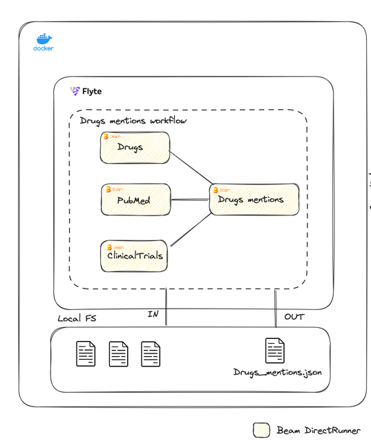
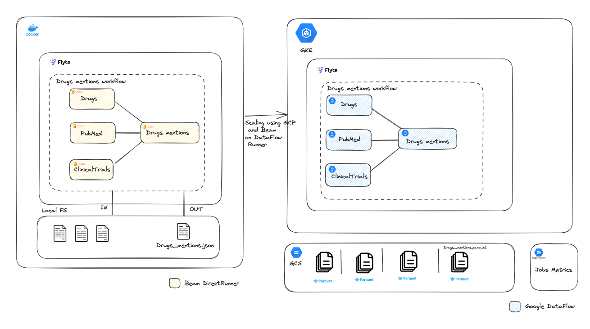

# Drugs mentions data pipelines

## 1. Data
The project works with the following four data files stored in `src/resources/{dataset}`:
- `drugs.csv`: Contains drug names with an ID (`atccode`) and a name (`drug`).
- `pubmed.csv`: Contains titles of PubMed articles (`title`) associated with a journal (`journal`) and a date (`date`), along with an ID (`id`).
- `pubmed.json`: Has the same structure as `pubmed.csv` but in JSON format.
- `clinical_trials.csv`: Contains scientific publications with a title (`scientific_title`), an ID (`id`), a journal (`journal`), and a date (`date`).


### Output JSON Schema Description

The JSON object represents a graph of drug data, where each entry corresponds to a unique drug. The 
key for each entry is the drug ID, and the associated value is an object detailing the drug's occurrences in different publications and clinical trials.

### Structure

```json
{
  "drugID": {
    "pubmed": [
      {
        "journalName": "date"
      },
      ...
    ],
    "clinical_trials": [
      {
        "journalName": "date"
      },
      ...
    ]
  },
  ...
}
```

## 2. Implementation

This project uses Apache Beam python SDK to build 4 pipelines that run on DirectRunner:
- clinical_trials_job.py
- drugs_job.py
- pubmed_job.py
- drugs_mentions_graph_job.py

These 4 aforementioned pipleines are orchestrated with Flyte, each pipeline has it's own task 
and workflow, and to simplify usage there's a workflow that orchestrate all pipleines at once 
and output a single file representing the drug mentions in a json file
## 3. Scaling

To scale this pipeline, many foundations are there. By using Beam and Parquet, it's possible 
with less effort to run the pipelines on DataFlow Runner and store data into GCS. An additional 
benefit would be taking advantage of GCS, Dataflow scalability, and also Stackdriver to access 
Beam metrics and logging.

On the orchestration side, we are using Flyte (flyte.org), scalling 
this is possible using GKE and Flyte kubernetes operator to manage flyte clusters, this scales 
orchestration and add scheduling capabilities which will be necessary when running this 
pipelines at scale and in production.

## 4. Ad-hoc Processing
To get the journal with the most different drugs mentions, a jupyter notebook 
`labs/journal_with_most_distinct_drugs.ipynb` is made available 
to easility explore the graph and access the results and tweak it as needed in interractive manner
## SQL
The SQL part of the project involves querying transactional data and product nomenclature data.
The SQL queries are made avaible in `docs/ex1.sql` and `docs/ex2.sql`

## Running the Project
Setup a new virtual environment with Python 3.9 then
- Run `Make install` to install dev requirements
- Run `Make test` to run tests
- Run `Make docker` to build docker
- Run `Make run` to run the flyte worklow running all pipelines

