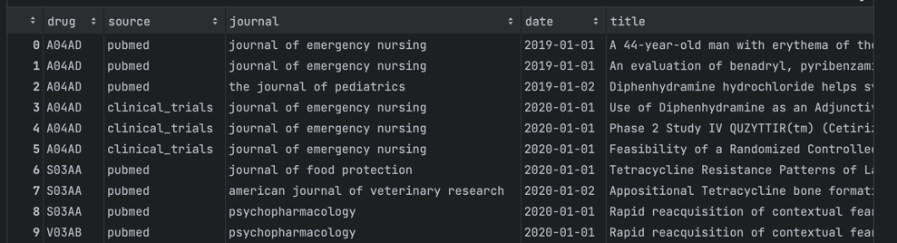

# Drugs mentions data pipelines

## 1. Data
The project works with the following four data files stored in `src/resources/{dataset}`:
- `drugs.csv`: Contains drug names with an ID (`atccode`) and a name (`drug`).
- `pubmed.csv`: Contains titles of PubMed articles (`title`) associated with a journal (`journal`) and a date (`date`), along with an ID (`id`).
- `pubmed.json`: Has the same structure as `pubmed.csv` but in JSON format.
- `clinical_trials.csv`: Contains scientific publications with a title (`scientific_title`), an ID (`id`), a journal (`journal`), and a date (`date`).


### Output JSON Schema Description

The JSON object represents a graph of drug data, where each entry corresponds to a unique drug. The 
key for each entry is the drug ID, and the associated value is an object detailing the drug's occurrences in different publications and clinical trials.

### Structure

```json
{
  "drugID": {
    "pubmed": [
      {
        "journalName": {"date": "%y-%m%d", "title": "...{drugId}..."
      },
      ...
    ],
    "clinical_trials": [
      {
        "journalName": {"date": "%y-%m%d", "title": "...{drugId}..."
      },
      ...
    ]
  },
  ...
}
```

## 2. Implementation


This project utilizes the Apache Beam Python SDK to construct four pipelines that run on DirectRunner:

clinical_trials_job.py
drugs_job.py
pubmed_job.py
drugs_mentions_graph_job.py
The aforementioned four pipelines are orchestrated with Flyte, with each pipeline having its own task and workflow. This approach helps modularize the different pipeline logics, and to simplify usage, there is a workflow that orchestrates all pipelines at once, outputting a single file representing the drug mentions in a JSON format. The output file for each intermediate pipeline is in .Parquet format, facilitating the future scaling of downstream pipelines.

Flyte is packaged in a Dockerfile, enabling any workflow to be run locally. Additionally, Beam 
counters are used to monitor and collect metrics from Beam jobs, paving the way for scaling these 
pipelines with Dataflow and integrating job metrics into Stackdriver.

Lastly, a pre-commit configuration is in place to ensure code style and formatting for each 
commit. This can also be executed using the makefile, which aids in running the workflow by 
building a docker image and running the one-click workflow, running tests, and 
formatting with `make format`
## 3. Scaling

To scale this pipeline, many foundations are there. By using Beam and Parquet, it's possible 
with less effort to run the pipelines on DataFlow Runner and store data into GCS. An additional 
benefit would be taking advantage of GCS, Dataflow scalability, and also Stackdriver to access 
Beam metrics and logging.

On the orchestration side, we are using Flyte (flyte.org), scalling 
this is possible using GKE and Flyte kubernetes operator to manage flyte clusters, this scales 
orchestration and add scheduling capabilities which will be necessary when running this 
pipelines at scale and in production.

Also regarding drug mentions graph output, when this scales to millions or 100s of millions rows,
running adhoc queries/tasks on top of a single json file won't be possible, to improve this part,
I propose to load this graph into a fact table into a datawarehouse like BigQuery for analytical 
purposes and adhoc queries, for this I propose this schema for the fact table:



This will help flatten the relationship between drugs, source of publications (publmed, clinical 
trials) and journal name and the date and mentions in journal title.

Finally, this is by no means an exhaustive list for productionizing this code, but here are some additional items that need to be addressed:

- Sanitizing checks the inputs needs to be improved, this is a first pass and didn't spend enough 
  time to clean, deduplicate, infer column values
- Ensure Flyte Tasks are idempotent by incorporating dates and ensuring output is reproducible for a given execution date
- Deploying workflows via Continuous Integration (CI)
- Building and testing CI pipelines at Pull Request (PR) build
- Implementing counter validation, count dropped/filtred rows
- Adding sensors for inputs
- Providing a Beam pipeline option to enable Dataflow Runner (or any other scalable runner)
- Increasing coverage
- Increase coverage of docstring 


## 4. Ad-hoc Processing
To get the journal with the most different drugs mentions, a jupyter notebook 
`labs/journal_with_most_distinct_drugs.ipynb` is made available 
to easility explore the graph and access the results and tweak it as needed in interractive manner
## SQL
The SQL part of the project involves querying transactional data and product nomenclature data.
The SQL queries are made avaible in `docs/ex1.sql` and `docs/ex2.sql`

## Running the Project
Setup a new virtual environment with Python 3.9 then
- Run `Make install` to install dev requirements
- Run `Make test` to run tests
- Run `Make run` to run the flyte worklow running all pipelines

